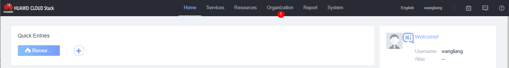
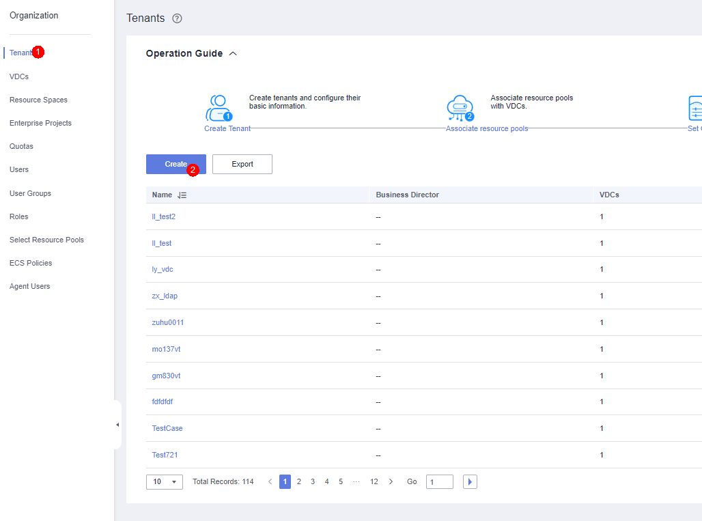
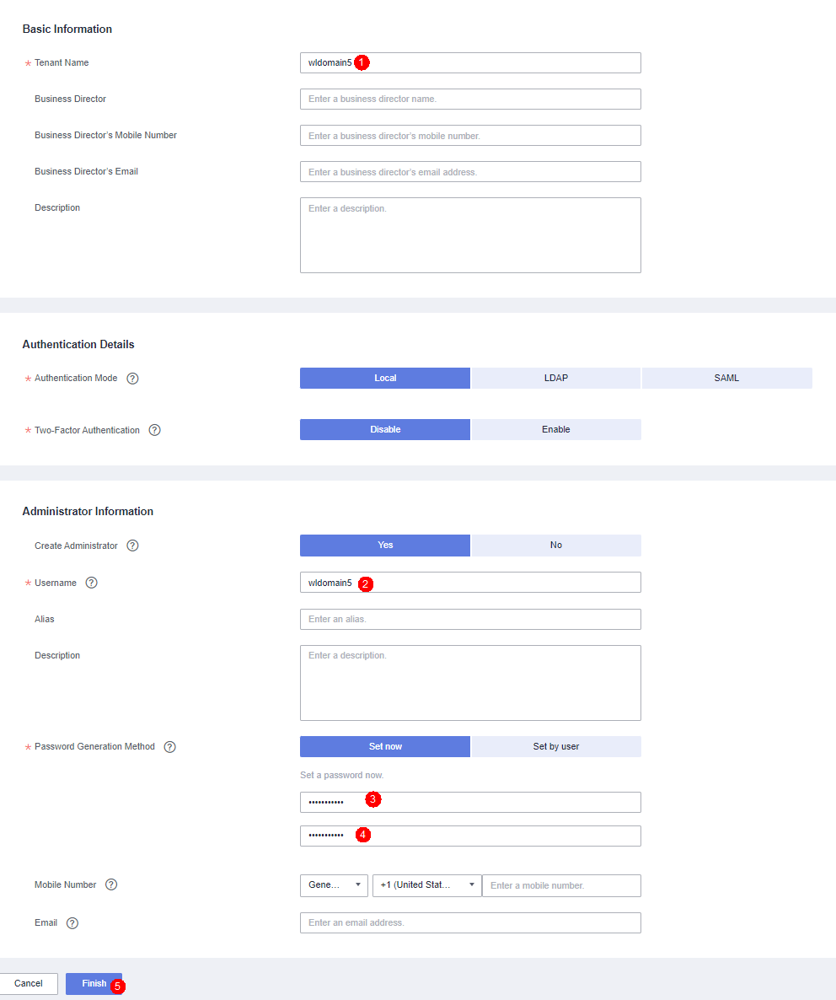
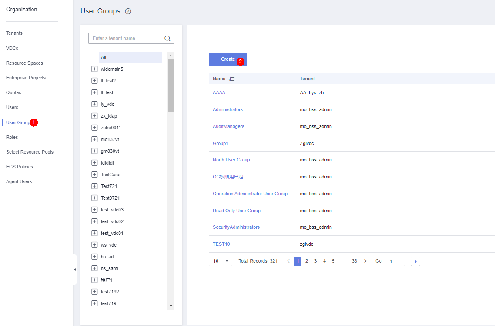
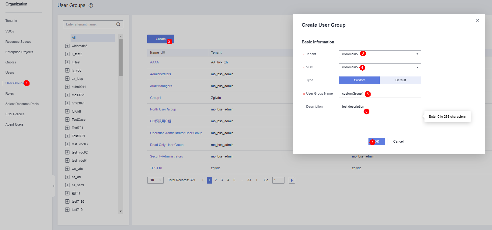
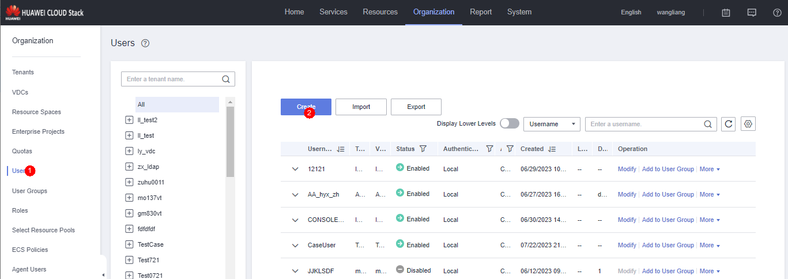
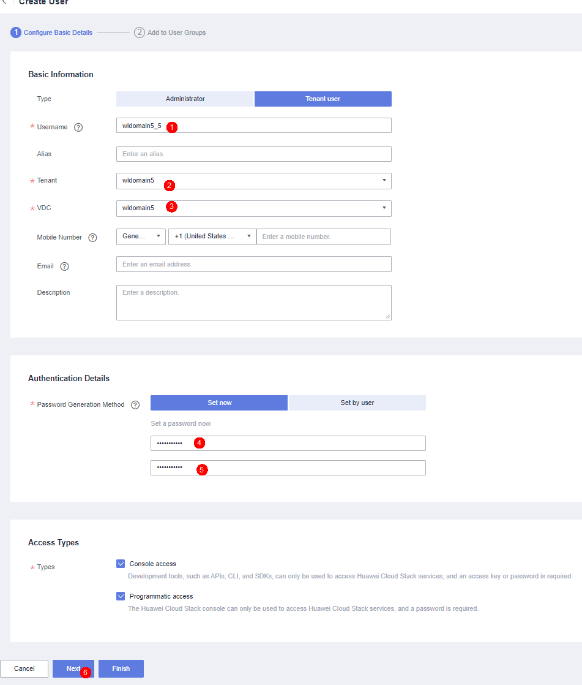
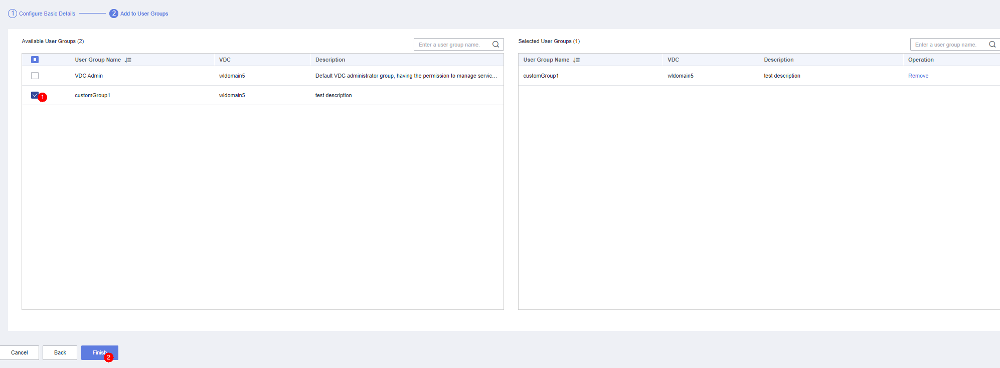

# Guide to Creating a Tenant, User Group, and User

## Creating a Tenant

- Log in to ManageOne Operation Portal as an administrator.
- 
- Choose **Organization** from the main menu.
- 
- In the navigation pane, choose **Tenants**. Click **Create**.
- 
- Configure tenant information and click **Finish**. Verify that the tenant is created successfully.

## Creating a User Group

- Log in to ManageOne Operation Portal as an administrator.
- 
- Choose **Organization** from the main menu.
- 
- In the navigation pane, choose **User Groups**. Click **Create**.
- 
- Configure user group information and click **OK**. Verify that the user group is created successfully.

## Creating a User

- Log in to ManageOne Operation Portal as an administrator. (Assume that a tenant user needs to be created.)
- 
- Choose **Organization** from the main menu.
- 
- In the navigation pane, choose **Users**. Click **Create**.
- 
- Configure user information and click **Next**.
- 
- Select the user groups where the user is to be added and click **Finish**. Verify that the tenant user is created successfully.
